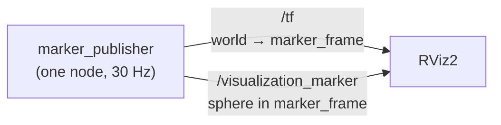

# Overview

A ROS 2 Jazzy workspace for learning RViz, running natively on macOS.

One node publishes a coordinate frame that orbits the origin, and a marker
attached to that frame. In RViz you see a blue sphere circling a grid.


## Contents

1. [The problem this solves](#1-the-problem-this-solves)
   · [Frames, not positions](#frames-not-positions)
   · [The one idea to take away](#the-one-idea-to-take-away)
   · [Vocabulary](#vocabulary)
2. [How the pieces connect](#2-how-the-pieces-connect)
   · [The motion](#the-motion)
   · [Parameters](#parameters)
3. [Running it](#3-running-it)
   · [What to expect](#what-to-expect)
   · [Checking it actually works](#checking-it-actually-works)
   · [Commands](#commands)
4. [Working on the code](#4-working-on-the-code)
   · [Layout](#layout)
   · [Adding to it](#adding-to-it)
5. [Notes and gotchas](#5-notes-and-gotchas)

---

## 1. The problem this solves

A running robot is invisible. Your code starts, numbers scroll past in the
terminal, and you have no way to tell whether any of it is right. Is the arm
where you think it is? Is the camera pointing the way you meant? Is the path
you planned actually in front of the robot, or behind it? A column of floating
point numbers will not tell you, and this is where most time gets lost early on.

### Frames, not positions

Robots describe the world in frames, not absolute positions. A robot almost
never knows "the gripper is at (1.2, 0.4, 0.8)". What it knows is a chain of
relationships: the gripper sits 10 cm from the wrist, the wrist 30 cm from the
elbow, the elbow is bolted to a base that is somewhere in the room. Each link in
that chain is a *coordinate frame* — an origin plus a set of axes attached to
one physical thing. The only question that ever matters is "where is this frame
relative to that one?"

**TF is the bookkeeping for those relationships.** Each part of the system
publishes just its own link — the arm publishes where the wrist is relative to
the elbow, and nothing else. TF chains those links together, so you can ask
"where is the gripper relative to the room?" and get an answer, including how it
changed over time. Without it, every node would need to know the whole robot.

**RViz is the window into all of it.** RViz is a viewer, not a simulator. It
subscribes to what your nodes publish and draws it: frames as little axis
crosses, sensor readings as points, and anything else you like as *markers* —
spheres, arrows, lines, text that you publish on a topic purely so a human can
see them. Marking up a scene this way is how you debug a robot that cannot tell
you what it is thinking.

This cuts both ways, and it is the usual first frustration: if RViz shows an
empty grid, that is information. It normally means nothing is being published,
or you are looking from the wrong frame — not that the robot is broken.

### The one idea to take away

You do not move the picture. You move the frame, and the picture follows.

The sphere here is a `visualization_msgs/Marker` sitting at the **origin of
`marker_frame`**, and it never moves in its own frame. Every drawing of it says
"a sphere, at (0, 0, 0), in `marker_frame`". What changes is where
`marker_frame` is, and RViz redraws the sphere wherever TF says that frame
currently is.

That seems like a detour for one sphere, but it is exactly how a real robot
works. The 3D mesh of a forearm is bolted to the forearm frame and stays there
forever; what moves is the frame. Get comfortable with the indirection on a
sphere and it costs you nothing later on a robot with forty of them.

### Vocabulary

| Term | Meaning |
| --- | --- |
| node | one program in the ROS system |
| topic | a named stream of messages that nodes publish to and subscribe from |
| frame | an origin and set of axes attached to one physical thing |
| transform | where one frame sits relative to another |
| TF | the system that tracks transforms and chains them together |
| marker | a shape published so a person can see it in RViz |
| fixed frame | the frame RViz draws everything relative to (here, `world`) |

---

## 2. How the pieces connect



The TF tree is two frames deep:


`world` is the fixed frame RViz renders against. `marker_frame` moves.

### The motion


A 2 m radius circle, one lap every 6 seconds, counter-clockwise. The frame's
+X axis stays tangent to the path, so it points the way it is travelling.

### Parameters

Both numbers are node parameters, so nothing is hardcoded into the geometry:

| Parameter | Default |
| --- | --- |
| `orbit_radius_m` | 2.0 |
| `orbit_period_s` | 6.0 |
| `publish_rate_hz` | 30.0 |
| `marker_diameter_m` | 0.4 |
| `world_frame` / `marker_frame` | `world` / `marker_frame` |

---

## 3. Running it

```
make demo
```

### What to expect

The first ever run downloads ROS 2 — several GB, several minutes. After that
the build takes about a second and RViz takes roughly ten seconds to appear.

In the terminal:

```
[marker_publisher-1] [INFO] [marker_publisher]: Publishing TF 'world' -> 'marker_frame'
                            and markers on 'visualization_marker' at 30 Hz
[rviz2-2] [INFO] [rviz2]: Stereo is NOT SUPPORTED
[rviz2-2] [INFO] [rviz2]: OpenGl version: 2.1 (GLSL 1.2)
```

Those two RViz lines are normal on macOS, not errors.

In the window: a dark grid, a blue sphere going round once every six seconds,
and a small set of red/green/blue axes riding along with it. The Displays
panel on the left lists Grid, TF and Marker, all with no warning triangles.

Ctrl-C in the terminal stops both.

### Checking it actually works

With `make demo` running, in a second terminal:

```
make topics     # expect /tf, /tf_static, /visualization_marker
make tf         # expect translations whose x,y always sum to a radius of 2.0
make marker     # expect type: 2 (SPHERE), frame_id: marker_frame
```

If `make tf` prints transforms but RViz shows nothing, the usual cause is the
Fixed Frame — it must be `world`, under Global Options.

### Commands

Run `make` for the full list.

```
make demo      build, then launch the node and RViz together
make build     rebuild after changing code
make test      run the unit tests
make lint      check code style
make shell     shell with ROS sourced, for plain ros2 commands
```

With the demo running: `make topics`, `make marker`, `make tf`,
`make frames` (TF tree as a PDF), `make graph` (rqt_graph).

---

## 4. Working on the code

### Layout

```
pixi.toml                              dependencies and tasks
Makefile                               entry point for everything
docs/
  overview.md                          this file
  diagrams.py                          regenerates the images below
  images/overview/                     scene.svg, motion.svg
src/rviz_basics/
  rviz_basics/marker_publisher.py      the node
  launch/marker_demo.launch.py         starts the node and RViz
  rviz/marker_demo.rviz                saved RViz layout
  test/                                unit tests
```

### Adding to it

**A node:** add the module under `rviz_basics/`, register it in `setup.py`
under `console_scripts`, then `make build`.

**A package:** create `src/<name>/` with its own `package.xml` and `setup.py`.
`make build` finds it automatically.

**A ROS dependency:** add `ros-jazzy-<name>` to `pixi.toml` and the plain name
to `package.xml`.

**A different motion:** `circular_orbit()` in `marker_publisher.py` is a plain
function of time, radius and period, with no ROS types in it. Replace it and
nothing else changes. Then regenerate the diagrams:

```
pixi run python docs/diagrams.py
```

---

## 5. Notes and gotchas

Python 3.12, setuptools `<80` and pytest `<8` are pinned on purpose. Each one
breaks the build if loosened — the reasons are in `pixi.toml`.

ROS 2 packages come from [RoboStack](https://robostack.github.io), because
there are no official ROS 2 binaries for macOS. Nothing is installed
system-wide; it all lives in `.pixi/`.

Closing the `make graph` window prints a non-zero exit warning. That is an rqt
bug on macOS, not a problem here.

Commit `pixi.lock` — it is what makes the environment reproducible.
