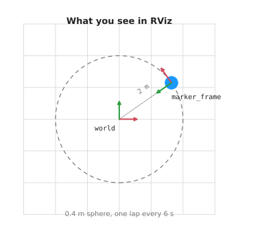
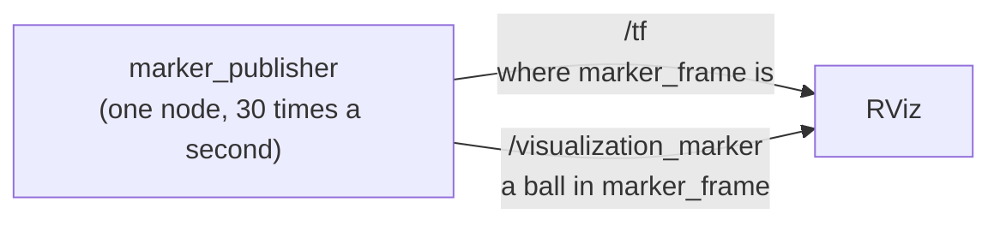
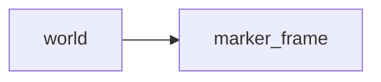
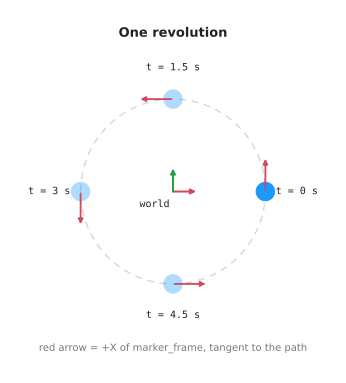

# Overview

A small project for learning RViz on a Mac.

A blue ball moves in a circle. That is all it does. The point is to show how
ROS keeps track of where things are, and how RViz draws them.



## Contents

1. [The problem this solves](#1-the-problem-this-solves)
   · [What this example stands for](#what-this-example-stands-for)
   · [Frames: how a robot stores position](#frames-how-a-robot-stores-position)
   · [TF, short for transform: joining the frames](#tf-short-for-transform-joining-the-frames)
   · [RViz, short for ROS Visualization: seeing it](#rviz-short-for-ros-visualization-seeing-it)
   · [The one idea to take away](#the-one-idea-to-take-away)
   · [Vocabulary](#vocabulary)
2. [How the pieces connect](#2-how-the-pieces-connect)
   · [The motion](#the-motion)
   · [Settings you can change](#settings-you-can-change)
3. [Running it](#3-running-it)
   · [What to expect](#what-to-expect)
   · [Checking it works](#checking-it-works)
   · [Commands](#commands)
4. [Working on the code](#4-working-on-the-code)
   · [Layout](#layout)
   · [Adding to it](#adding-to-it)
5. [Notes and gotchas](#5-notes-and-gotchas)

---

## 1. The problem this solves

When you work with robots, you want to see what the robot is doing.

Where is the arm right now? Which way is the camera pointing? Did the robot go
where you told it to go?

You cannot answer that from numbers scrolling past in a terminal.

**ROS** stands for **Robot Operating System**. The name is misleading. It is not
an operating system. It is a set of libraries and tools for writing robot
software. This project uses ROS 2, the current version.

ROS gives you three things that work together here:

- **Topics** carry data from one program to another.
- **TF**, short for **transform**, keeps track of where every part of the robot
  is.
- **RViz**, short for **ROS Visualization**, draws it on screen so you can look
  at it.

This project is a small working example of all three.

### What this example stands for

Here, a blue ball moves in a circle.

It stands in for a real robot doing the same kind of thing:

- a robot arm moving its gripper in a circle above a table
- a drone flying a loop around a tower
- a mobile robot driving one lap of a room

In each case, one part moves and the rest stays still. To draw that, you need
two things about the moving part at every moment:

1. **where it is** — its position
2. **which way it faces** — its rotation

Together these are called a **pose**. A robot works out poses many times a
second. This example does it 30 times a second.

### Frames: how a robot stores position

A robot does not keep one big list of positions. It keeps small relationships
instead.

Take a robot arm:

- the gripper is 10 cm from the wrist
- the wrist is 30 cm from the elbow
- the elbow is fixed to the base
- the base sits somewhere in the room

Each part gets a **frame**. A frame is a point with three axes (X, Y, Z) stuck
to one physical thing.

It is done this way so each part only has to know about the part next to it.
The gripper does not need to know where the room is.

### TF, short for transform: joining the frames

A **transform** is where one frame is, compared to another. **TF** is the part
of ROS that keeps track of them all. The name is just short for transform.

Each part reports one link, and only that link. The arm says where the wrist is
compared to the elbow. Nothing more.

TF adds the links together. So you can ask "where is the gripper in the room?"
and get an answer, even though nobody wrote that down anywhere.

This example has two frames. `world` stays still. `marker_frame` moves.

### RViz, short for ROS Visualization: seeing it

**RViz** is a 3D viewer. It listens to what your programs send, and draws it:

- frames, as small red, green and blue arrows
- sensor data, as points
- shapes you add yourself, called **markers** — balls, arrows, lines, text

RViz does not run the robot. It only shows what the robot says.

That is worth remembering when the screen is empty. It usually means nothing is
being sent, or you are looking from the wrong frame. It does not mean the robot
is broken.

### The one idea to take away

You do not move the ball. You move the frame, and the ball goes with it.

The ball is a marker placed at (0, 0, 0) in `marker_frame`, and it stays there.
Every message says the same thing: a ball, in the middle of `marker_frame`.

What changes is where `marker_frame` is. TF moves the frame, and RViz draws the
ball in its new spot.

This looks like extra work for one ball. It is not. On a real robot, the 3D
shape of a forearm is fixed to the forearm frame and never moves from it. Only
the frame moves. Learn it here with one ball, and it costs you nothing later
with forty parts.

### Vocabulary

| Term | Full name | Meaning |
| --- | --- | --- |
| ROS | Robot Operating System | libraries and tools for robot software, not an actual operating system |
| node | — | one running program |
| topic | — | a named channel that programs send messages on |
| frame | — | a point with three axes, attached to one thing |
| transform | — | where one frame is, compared to another |
| pose | — | position and rotation together |
| TF | transform | the system that keeps track of frames |
| RViz | ROS Visualization | the 3D viewer that comes with ROS |
| marker | — | a shape you send so a person can see it in RViz |
| fixed frame | — | the frame RViz draws everything from (here, `world`) |
| rqt | ROS Qt | small windowed tools for ROS; `make graph` opens one |

---

## 2. How the pieces connect

One node sends two things. RViz reads both.



The frames:



`world` stays still, and RViz draws everything from it. `marker_frame` moves.

### The motion



The circle is 2 metres from the middle. One lap takes 6 seconds. The frame
turns as it goes, so its red arrow always points the way it is moving.

### Settings you can change

You do not need to edit any maths to change these. They are node settings:

| Setting | Default | What it does |
| --- | --- | --- |
| `orbit_radius_m` | 2.0 | how far out the ball sits, in metres |
| `orbit_period_s` | 6.0 | seconds for one lap |
| `publish_rate_hz` | 30.0 | updates per second |
| `marker_diameter_m` | 0.4 | how big the ball is, in metres |
| `world_frame` | `world` | name of the still frame |
| `marker_frame` | `marker_frame` | name of the moving frame |

The `_hz` in that third name is short for **hertz**, which just means times per
second.

---

## 3. Running it

```
make demo
```

### What to expect

The first time you run this, it downloads ROS 2. That is a few gigabytes and
takes a few minutes. After that, the build takes about a second, and RViz takes
about ten seconds to open.

In the terminal:

```
[marker_publisher-1] [INFO] [marker_publisher]: Publishing TF 'world' -> 'marker_frame'
                            and markers on 'visualization_marker' at 30 Hz
[rviz2-2] [INFO] [rviz2]: Stereo is NOT SUPPORTED
[rviz2-2] [INFO] [rviz2]: OpenGl version: 2.1 (GLSL 1.2)
```

Those last two lines look like problems. They are not. They are normal on a Mac.
They are RViz reporting which graphics features it found.

In the window you should see:

- a dark grid
- a blue ball going round once every six seconds
- small red, green and blue arrows moving with the ball

On the left, the Displays panel lists Grid, TF and Marker. None of them should
have a warning triangle.

Press Ctrl-C in the terminal to stop everything.

### Checking it works

Leave `make demo` running. Open a second terminal and try these:

```
make topics     # should list /tf, /tf_static, /visualization_marker
make tf         # should print numbers that keep changing
make marker     # should print type: 2 and frame_id: marker_frame
```

If `make tf` prints numbers but RViz stays empty, check the Fixed Frame. It
must be set to `world`. You will find it in RViz under Global Options.

### Commands

Run `make` on its own to see the full list.

```
make demo      build, then start the node and RViz
make build     rebuild after you change code
make test      run the tests
make lint      check code style
make shell     a shell with ROS ready, for typing ros2 commands
```

While the demo is running, these show you what is going on:

```
make topics    list the topics
make marker    print one marker message
make tf        follow the moving frame
make frames    save the frames as a PDF
make graph     open a picture of the nodes and topics
```

---

## 4. Working on the code

### Layout

```
pixi.toml                              what to install, and the tasks
Makefile                               all the commands
docs/
  overview.md                          this file
  diagrams.py                          redraws the pictures below
  images/overview/                     scene.svg, motion.svg
src/rviz_basics/
  rviz_basics/marker_publisher.py      the node
  launch/marker_demo.launch.py         starts the node and RViz together
  rviz/marker_demo.rviz                the saved RViz layout
  test/                                the tests
```

### Adding to it

**Add a node.** Put a new `.py` file in `rviz_basics/`. Add a line for it in
`setup.py` under `console_scripts`. Run `make build`.

**Add a package.** Make a folder `src/<name>/` with its own `package.xml` and
`setup.py`. `make build` will find it on its own.

**Add a ROS library.** Put `ros-jazzy-<name>` in `pixi.toml`, and the plain name
in `package.xml`.

**Change the motion.** `circular_orbit()` in `marker_publisher.py` takes a time,
a radius and a lap length, and gives back a position. It has no ROS code in it,
so you can swap it for any path you like and nothing else changes.

If you change the radius or the lap time, redraw the pictures in this file:

```
pixi run python docs/diagrams.py
```

---

## 5. Notes and gotchas

**pixi** is the tool that installs everything and pins the versions.
**RoboStack** is the collection of ROS 2 packages it downloads from. There is no
official ROS 2 build for macOS, which is why RoboStack is needed at all.

Nothing is installed onto your system. It all sits in `.pixi/` inside this
folder. `make clean`, then deleting that folder, removes every trace.

Python 3.12, setuptools below 80, and pytest below 8 are pinned on purpose. If
you raise any of them, the build breaks. The reasons are written down in
`pixi.toml`.

When you close the `make graph` window, it prints an error as it exits. That is
a bug in rqt, the ROS Qt toolset behind that command. You can ignore it.

Keep `pixi.lock` in git. It is what lets someone else end up with the exact same
setup as you.
