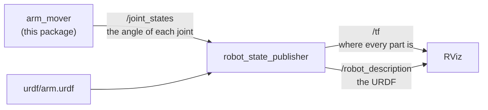

# ROS arm: moving an arm

Moving an arm in ROS comes down to one topic, `/joint_states`, where the angle
of every joint is published. A standard node reads those angles, together with a
description of the arm, and works out where every part of the arm is, and RViz
draws the arm there. So a program that publishes new angles makes the arm move.
This doc builds the smallest version of that, in the `ros_arm` package: a
two-joint arm described in URDF, and `arm_mover`, a program that swings it back
and forth.

It builds on the [ROS intro](ros-intro.md), which explains nodes, topics,
messages, and what TF and URDF are for.

## Contents

1. [The arm](#1-the-arm)
2. [How an arm moves in ROS](#2-how-an-arm-moves-in-ros)
3. [The joint state message](#3-the-joint-state-message)
4. [The program](#4-the-program)
5. [Running it](#5-running-it)
6. [A real arm](#6-a-real-arm)

---

## 1. The arm

The arm is the simplest one that can point anywhere in front of it. It has a base
that sits on the table, a turret on top of the base that turns left and right,
and a bar, 25 cm long, that tilts up and down. The two joints are called `pan`,
for turning left and right, and `tilt`, for tipping up and down, which are the
usual names for those two movements.


The arm is described in `urdf/arm.urdf`, in URDF, the XML format ROS uses to
describe robots. A URDF file lists the arm's **links**, which are its rigid
parts, and its **joints**, which say how each link is attached to the one before
it. This is the `pan` joint:

```xml
<joint name="pan" type="revolute">
  <parent link="base_link"/>
  <child link="turret"/>
  <origin xyz="0 0 0.04"/>
  <axis xyz="0 0 1"/>
  <limit lower="-1.57" upper="1.57" effort="1" velocity="1"/>
</joint>
```

`revolute` means the joint turns. It joins the `turret` to the `base_link`, 4 cm
above the base's bottom, which is where the base's top is. `axis` is the line it
turns around, here the upright z axis, and `limit` says how far it can turn:
1.57 radians, which is 90°, either way. The `tilt` joint is written the same way,
turning around a sideways axis, and a third joint, of type `fixed`, bolts the
`tip` to the end of the bar. Each link also has a `visual`, the shape RViz draws
for it: a cylinder for the base and the turret, and a box for the bar.

Angles in ROS are always in **radians**, not degrees. A full turn is 2π radians,
so 1 radian is about 57°, and 30° is about 0.52 radians.

## 2. How an arm moves in ROS

Three nodes take part, and each has one job:



**arm_mover**, this package's program, decides where the joints should be, and
publishes their angles on `/joint_states`, twenty times a second.

**robot_state_publisher** is a standard ROS node. It reads the URDF when it
starts, and every time new joint angles arrive, it works out where every link of
the arm is and publishes that on TF. The URDF says where each joint is and which
way it turns, and the angles say how far it has turned, which together are
everything needed. It also publishes the URDF itself on `/robot_description`, so
that other nodes, such as RViz, can read it.

**RViz** reads the URDF to know what each link looks like, and TF to know where
each link is, and draws the arm. When the angles change, the arm moves on screen.

## 3. The joint state message

The angles travel as `sensor_msgs/JointState` messages, which hold two matching
lists: the names of the joints, as they are in the URDF, and the position of each
one, in the same order. For a joint that turns, the position is an angle in
radians. The message can also carry each joint's speed and effort, the force it
is pushing with, but those lists can be left empty, and here they are. This is
one message, as `ros2 topic echo --once /joint_states` printed it:

```
header:
  stamp:
    sec: 1789421229
    nanosec: 870756000
  frame_id: ''
name:
- pan
- tilt
position:
- -0.9991948386373578
- 0.7875700316478574
velocity: []
```

At that moment, `pan` was at −1.0 radians, about 57° to the right, and `tilt` was
at 0.79 radians, about 45° up.

## 4. The program

`arm_mover` has one job: twenty times a second, work out where the joints should
be, and publish it. In pseudo code:

```
when the program starts:
    create a publisher for joint angles, on /joint_states
    ask ROS to call publish_pose every 0.05 seconds

publish_pose:
    seconds = how long the program has been running
    pan  = 1.0 × sin(0.5 × seconds)              swings between -1 and 1 radian
    tilt = 0.4 + 0.4 × sin(0.8 × seconds)        nods between 0 and 0.8 radians
    publish a JointState with the names pan and tilt, and these two angles
```

The two joints swing at different speeds, so the tip of the arm traces a slow
loop instead of moving back and forth along one line. The angles always stay
inside the joints' limits in the URDF, which the package's tests check. This is
the core of `ros_arm/arm_mover.py`:

```python
def arm_pose(seconds):
    pan = 1.0 * math.sin(0.5 * seconds)
    tilt = 0.4 + 0.4 * math.sin(0.8 * seconds)
    return pan, tilt


class ArmMover(Node):
    def __init__(self):
        super().__init__('arm_mover')
        self.publisher = self.create_publisher(JointState, '/joint_states', 10)
        self.start = self.get_clock().now()
        self.timer = self.create_timer(0.05, self.publish_pose)

    def publish_pose(self) -> None:
        now = self.get_clock().now()
        pan, tilt = arm_pose((now - self.start).nanoseconds / 1e9)
        msg = JointState()
        msg.header.stamp = now.to_msg()
        msg.name = ['pan', 'tilt']
        msg.position = [pan, tilt]
        self.publisher.publish(msg)
```

The launch file, `launch/arm.launch.py`, starts the three nodes from section 2.
It reads the URDF file and hands its text to robot_state_publisher as a
**parameter**, a setting given to a node when it starts:

```python
with open(os.path.join(share, 'urdf', 'arm.urdf')) as urdf:
    description = urdf.read()
...
Node(package='robot_state_publisher', executable='robot_state_publisher',
     parameters=[{'robot_description': description}]),
Node(package='ros_arm', executable='arm_mover'),
```

## 5. Running it

```
make ros.arm
```

This builds the workspace and starts the launch file. RViz opens and shows the
arm swinging left and right and nodding up and down, with a small set of axes at
each link, which are the frames TF knows about. Press Ctrl-C to stop it.

While it runs, a second terminal, opened with `make shell`, can watch it.
`ros2 topic hz /joint_states` shows the twenty messages a second:

```
average rate: 19.950
	min: 0.040s max: 0.057s std dev: 0.00453s window: 20
```

`tf2_echo` asks TF where one frame is compared with another. This asks where the
tip of the arm is, measured from the base:

```
ros2 run tf2_ros tf2_echo base_link tip
```

```
At time 1789421231.70862000
- Translation: [0.133, -0.137, 0.262]
- Rotation: in Quaternion (xyzw) [-0.134, -0.317, -0.366, 0.864]
- Rotation: in RPY (radian) [-0.000, -0.703, -0.802]
- Rotation: in RPY (degree) [-0.000, -40.297, -45.950]
```

The translation says that, at that moment, the tip was 13.3 cm in front of the
base, 13.7 cm to its right, which is negative y, and 26.2 cm up. The rotation is
the same two joint angles again: a yaw of −0.802 radians is the pan, turned to the
right, and a pitch of −0.703 radians is the tilt, 0.703 radians up, since pitch
is measured the other way round. The numbers keep changing, because the arm keeps
moving, and nothing in `arm_mover` worked any of them out: robot_state_publisher
did, from the URDF and the two angles.

## 6. A real arm

On a real arm, a program like `arm_mover` does not publish `/joint_states`
itself. It sends the angles it wants to the arm's **controller**, the software
that drives the motors, usually through **ros2_control**, ROS's standard way of
connecting to motors. The controller moves the motors, reads where they actually
are from their sensors, and publishes that on `/joint_states`. Everything after
that, robot_state_publisher, TF and RViz, is exactly as it is here. Planning a
safe path for a real arm, instead of swinging it, is the job of **MoveIt**, which
the [tools and libraries](../tools-and-libraries.md) doc describes.

Next: [ROS camera and arm](ros-camera-arm.md), which points the arm at what the
camera sees.
