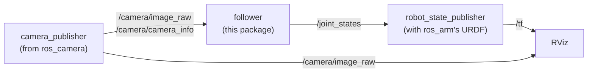
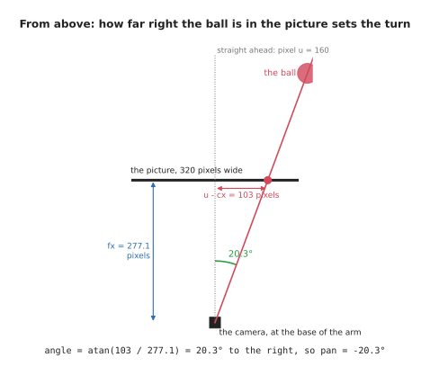

# ROS camera and arm: pointing at what the camera sees

The [camera example](ros-camera.md) found a ball in the camera's pictures, and
the [arm example](ros-arm.md) moved an arm by publishing its joint angles. This
example joins them: a program called `follower` watches the camera, finds the
ball, and points the arm at it, so that the arm follows the ball as it moves.
It is the smallest version of what a robot does when it picks something up,
which is to see where a thing is and then move towards it.

The `ros_camera_arm` package holds only the follower. The camera comes from the
`ros_camera` package and the arm from the `ros_arm` package, which shows how ROS
packages are built to be reused.

## Contents

1. [How the pieces connect](#1-how-the-pieces-connect)
2. [From a pixel to an angle](#2-from-a-pixel-to-an-angle)
3. [The program](#3-the-program)
4. [Running it](#4-running-it)
5. [What changes on a real robot](#5-what-changes-on-a-real-robot)

---

## 1. How the pieces connect

Four nodes take part. Three of them are the ones from the other two examples, and
only the follower is new:



The follower takes the place of the arm example's `arm_mover`. Both publish the
arm's joint angles on `/joint_states`, and robot_state_publisher does not know or
care which one is doing it. The only difference is where the angles come from:
`arm_mover` makes them up, and the follower works them out from the camera's
pictures. This is the main thing to take from the example: because nodes only
meet through topics, one can be swapped for another that publishes the same
messages, and nothing else changes.

The follower subscribes to two topics, and publishes on one. It needs the
pictures to find the ball, and it needs the camera info, because the lens numbers
are what turn a position in the picture into an angle.

## 2. From a pixel to an angle

The camera sits at the arm's base, looking the same way the arm points when both
of its joints are at zero, straight ahead along x. So if the ball appears in the
middle of the picture, it is straight ahead, and the arm should not turn at all.
If it appears to the right of the middle, the arm has to turn right, and the
question is how far.

The [camera basics](../camera/basics.md#3-what-a-picture-loses) explain that
every pixel looks out along one straight line from the lens, so a pixel is a
direction. A pixel that is `u - cx` pixels to the right of the middle looks along
a line that goes `u - cx` to the side for every `fx` it goes forward, where `fx`
is the focal length in pixels. That makes a right-angled triangle, and the angle
at its corner is the angle the arm has to turn:



```
angle to the side = atan((u - cx) / fx)
angle up          = atan((cy - v) / fy)
```

The second line is the same thing for up and down, using `v`, the pixel's row.
It is `cy - v` rather than `v - cy` because `v` counts downwards from the top of
the picture, so a ball above the middle has a `v` smaller than `cy`.

The ball in the [camera doc's picture](ros-camera.md#1-the-two-programs) is at
pixel (263, 188). It is 103 pixels right of the middle and 68 pixels below it,
and the camera's `fx` and `fy` are 277.1, so the arm has to turn 20.3° to the
right and tip 13.8° down. The arm's joints measure turning left and tipping up as
positive, as the [arm doc](ros-arm.md#1-the-arm) shows, so the follower publishes
a pan of −20.3° and a tilt of −13.8°, in radians: −0.354 and −0.241.

## 3. The program

The follower does its work each time a picture arrives. In pseudo code:

```
when the program starts:
    subscribe to /camera/camera_info, and keep the lens numbers
    subscribe to /camera/image_raw, and call on_picture with every picture
    create a publisher for joint angles, on /joint_states

on_picture:
    if no lens numbers have arrived yet, wait for the next picture
    find the ball, as the camera subscriber does
    if there is no ball, leave the arm where it is
    pan  = -atan((u - cx) / fx)        right of the middle is a turn to the right
    tilt =  atan((cy - v) / fy)        above the middle is a tilt up
    publish a JointState with pan, tilt, and the gripper held open
```

This is the core of `ros_camera_arm/follower.py`. It does not find the ball
itself: it imports `find_ball()` from the `ros_camera` package, which the camera
subscriber uses too.

```python
from ros_camera.camera_subscriber import find_ball


def pixel_to_angles(u, v, fx, fy, cx, cy):
    pan = -math.atan2(u - cx, fx)
    tilt = math.atan2(cy - v, fy)
    return pan, tilt


class Follower(Node):
    def __init__(self):
        super().__init__('follower')
        self.bridge = CvBridge()
        self.lens = None
        self.create_subscription(CameraInfo, '/camera/camera_info', self.on_camera_info, 10)
        self.create_subscription(Image, '/camera/image_raw', self.on_picture, 10)
        self.publisher = self.create_publisher(JointState, '/joint_states', 10)

    def on_camera_info(self, msg):
        self.lens = (msg.k[0], msg.k[4], msg.k[2], msg.k[5])       # fx, fy, cx, cy

    def on_picture(self, msg):
        if self.lens is None:
            return
        ball = find_ball(self.bridge.imgmsg_to_cv2(msg, desired_encoding='rgb8'))
        if ball is None:
            return
        pan, tilt = pixel_to_angles(*ball, *self.lens)
        joints = JointState()
        joints.header.stamp = msg.header.stamp
        joints.name = ['pan', 'tilt', 'gripper']
        joints.position = [pan, tilt, 0.02]           # the gripper stays open
        self.publisher.publish(joints)
```

`math.atan2(a, b)` is the angle whose tangent is `a / b`, which is the `atan`
from section 2, written the way Python prefers. The joint message is stamped with
the picture's timestamp, so that anyone reading it knows which picture the angles
came from. The arm's URDF also has a gripper, as the
[arm doc](ros-arm.md#6-the-gripper) explains, and robot_state_publisher needs a
position for every joint before RViz can draw the whole arm, so the follower
keeps the gripper open at 0.02 metres.

This package's `package.xml` lists `ros_camera` and `ros_arm` among the packages
it needs, which is what lets the follower import from `ros_camera`, and lets its
launch file start `ros_camera`'s publisher and read `ros_arm`'s URDF:

```python
with open(os.path.join(get_package_share_directory('ros_arm'), 'urdf', 'arm.urdf')) as urdf:
    description = urdf.read()
...
Node(package='ros_camera', executable='camera_publisher'),
Node(package='robot_state_publisher', executable='robot_state_publisher',
     parameters=[{'robot_description': description}]),
Node(package='ros_camera_arm', executable='follower', output='screen'),
```

## 4. Running it

```
make ros.camera_arm
```

This builds the workspace and starts the launch file. RViz shows the arm and the
camera's picture side by side, and as the ball moves in the picture, the arm turns
to follow it. The follower prints what it sees and how it turns the arm, once a
second:

```
[follower-3] [INFO] [...] [follower]: ball at pixel (205, 161): pan -9°, tilt -8°
[follower-3] [INFO] [...] [follower]: ball at pixel (257, 190): pan -19°, tilt -14°
```

The ball in the first line is 45 pixels right of the middle and 41 below it, so
the arm turns 9° right and tips 8° down, and a second later the ball has moved
further right and down, and the arm has followed it. Press Ctrl-C to stop it.

In a second terminal, `ros2 topic info --verbose /joint_states` shows who is
publishing the joint angles and who is receiving them. `--verbose` adds the name
of each node:

```
Publisher count: 1
Node name: follower
Endpoint type: PUBLISHER
Subscription count: 1
Node name: robot_state_publisher
Endpoint type: SUBSCRIPTION
```

It is the same topic as in the arm example, with the follower publishing on it
instead of `arm_mover`. `ros2 run tf2_ros tf2_echo base_link tip` shows the tip of
the arm moving, as it does in the [arm doc](ros-arm.md#5-running-it).

## 5. What changes on a real robot

The idea is exactly the same on a real robot, and the node graph from section 1
barely changes: a real camera driver takes the place of `camera_publisher`, and
the arm's controller takes the place of publishing `/joint_states` directly, as
the [arm doc](ros-arm.md#8-a-real-arm) explains. Three things do get harder.

- **Where the camera is.** Here the camera sits exactly at the arm's base,
  looking the same way, so a direction from the camera is a direction from the
  arm. On a real robot the camera is somewhere else, and its position is measured
  by calibration and published on TF, which then moves every direction from the
  camera's frame into the arm's.
- **How far away the ball is.** A picture only gives a direction, so this arm can
  point at the ball, but it cannot reach it, because it does not know how far away
  it is. A depth camera gives the distance too, and the
  [one-box intro](../camera/one-box-intro.md) shows how a direction and a distance
  make a point in the room.
- **Finding the object.** A red ball on a grey background is easy to find by
  colour. Real objects need better methods, which is what most of a robot's
  vision code is about.

Previous: [ROS arm](ros-arm.md). Back to the [ROS intro](ros-intro.md).
