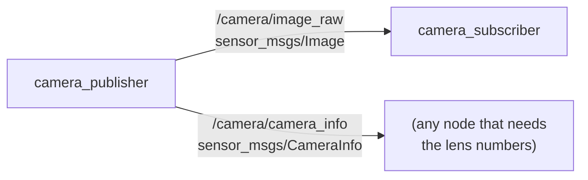

# ROS camera: publishing and receiving pictures

A robot's camera is only useful if other programs can use its pictures. In ROS,
that works in the same way for every camera: one node, called the camera
**driver**, publishes each picture on a topic, and any node that needs pictures
subscribes to that topic. This doc builds the smallest version of both, as two
programs in the `ros_camera` package: `camera_publisher`, which plays the part of
the driver, and `camera_subscriber`, which receives each picture and finds a red
ball in it.

It builds on the [ROS intro](ros-intro.md), which explains nodes, topics and
messages.

## Contents

1. [The two programs](#1-the-two-programs)
2. [What a picture message holds](#2-what-a-picture-message-holds)
3. [The publisher](#3-the-publisher)
4. [The subscriber](#4-the-subscriber)
5. [Running it](#5-running-it)
6. [A real camera](#6-a-real-camera)

---

## 1. The two programs

The two programs are two nodes, joined by two topics. The publisher sends a
picture on `/camera/image_raw` ten times a second, and the camera's lens numbers
on `/camera/camera_info` with each one. The subscriber receives the pictures. It
does not need the lens numbers, but the [camera and arm
example](ros-camera-arm.md) does.



A real driver would read its pictures from a camera, but this computer, like
many, has no camera, so the publisher draws its own: a red ball moving in a slow
loop over a grey background. It is a stand-in for the camera, not a simulation of
one. The message it publishes is exactly the kind a real driver publishes, so the
subscriber cannot tell the difference, and section 6 shows how to swap in a real
camera.


## 2. What a picture message holds

A picture travels as a `sensor_msgs/Image` message. The message cannot hold a
picture as a grid, so it holds the picture's size, and then every pixel's numbers
in one long list of bytes, row after row. The diagram shows that for a picture
only 3 pixels wide and 2 pixels tall.


These are the message's parts, with the values the publisher sends:

| Field | What it holds | Here |
| --- | --- | --- |
| `header.stamp` | when the picture was taken | the time it was drawn |
| `header.frame_id` | the frame the picture was taken in | `camera` |
| `height`, `width` | the picture's size, in pixels | 240, 320 |
| `encoding` | what each pixel's numbers mean | `rgb8`: red, green and blue, one byte each |
| `step` | how many bytes one row takes | 320 pixels × 3 bytes = 960 |
| `data` | every pixel's numbers, row after row | 240 rows × 960 bytes = 230,400 bytes |

The lens numbers travel separately, as a `sensor_msgs/CameraInfo` message. Its
field `k` holds the four lens numbers from the [camera
basics](../camera/basics.md#6-the-lens-as-four-numbers), `fx`, `fy`, `cx` and
`cy`, laid out as a 3 × 3 grid and written as nine numbers, row by row: `[fx, 0,
cx, 0, fy, cy, 0, 0, 1]`. The publisher's lens sees 60° across, so `fx` and `fy`
are 277.1, and the middle of its picture, `cx` and `cy`, is at pixel (160, 120).

## 3. The publisher

The publisher has to do the same thing ten times a second: draw the next picture,
and publish it. In pseudo code:

```
when the program starts:
    create a publisher for pictures, on /camera/image_raw
    create a publisher for lens numbers, on /camera/camera_info
    ask ROS to call publish_picture every 0.1 seconds

publish_picture:
    work out where the ball is now
    draw the grey picture with the ball on it
    put the picture into an Image message: its size, its encoding, its bytes
    put the lens numbers into a CameraInfo message
    stamp both with the same time, and publish them
```

In ROS, a node does something regularly with a **timer**, rather than with a loop
of its own: `create_timer(0.1, self.publish_picture)` asks ROS to call
`publish_picture` every 0.1 seconds, and `rclpy.spin()` keeps the program running
so that it can. This is the core of `ros_camera/camera_publisher.py`:

```python
class CameraPublisher(Node):
    def __init__(self):
        super().__init__('camera_publisher')
        self.image_publisher = self.create_publisher(Image, '/camera/image_raw', 10)
        self.info_publisher = self.create_publisher(CameraInfo, '/camera/camera_info', 10)
        self.start = self.get_clock().now()
        self.timer = self.create_timer(0.1, self.publish_picture)

    def publish_picture(self) -> None:
        now = self.get_clock().now()
        seconds = (now - self.start).nanoseconds / 1e9
        picture = draw_picture(*ball_position(seconds))

        image = Image()
        image.header.stamp = now.to_msg()
        image.header.frame_id = 'camera'
        image.height, image.width = HEIGHT, WIDTH
        image.encoding = 'rgb8'
        image.step = WIDTH * 3
        image.data = picture.tobytes()
        self.image_publisher.publish(image)
```

`draw_picture()` draws the picture as a NumPy array, and `picture.tobytes()`
turns that array into the long list of bytes the message holds. The 10 in
`create_publisher()` is how many messages ROS keeps waiting if a subscriber is
slow to take them. The camera info message is filled in and published the same
way, with the same timestamp, so that a node receiving both knows they belong
together.

## 4. The subscriber

The subscriber does nothing until a picture arrives, and then it looks for the
ball in it. In pseudo code:

```
when the program starts:
    subscribe to /camera/image_raw, and call on_picture with every picture

on_picture:
    turn the message back into a grid of pixels
    find the red pixels: a high red number, and low green and blue numbers
    the ball's middle is the average position of its red pixels
    print where it is, at most once a second
```

The function ROS calls with each message is the **callback**, here
`on_picture`. Turning the message back into a grid of pixels would mean undoing
section 2 by hand, so the subscriber uses **cv_bridge**, a standard ROS library
that turns an image message into a NumPy array, one entry per pixel. This is the
core of `ros_camera/camera_subscriber.py`:

```python
def find_ball(picture):
    red, green, blue = picture[..., 0], picture[..., 1], picture[..., 2]
    is_red = (red > 150) & (green < 100) & (blue < 100)
    if not is_red.any():
        return None
    rows, cols = np.nonzero(is_red)
    return float(cols.mean()) + 0.5, float(rows.mean()) + 0.5


class CameraSubscriber(Node):
    def __init__(self):
        super().__init__('camera_subscriber')
        self.bridge = CvBridge()
        self.pictures = 0
        self.create_subscription(Image, '/camera/image_raw', self.on_picture, 10)

    def on_picture(self, msg: Image) -> None:
        self.pictures += 1
        picture = self.bridge.imgmsg_to_cv2(msg, desired_encoding='rgb8')
        ball = find_ball(picture)
        ...
```

`find_ball()` adds 0.5 because a pixel's middle is half a pixel from its corner,
as the [camera basics](../camera/basics.md#a-grid-of-pixels) explain. The
subscriber knows nothing about the publisher: it only knows the topic's name and
the message type, which is what lets a real camera take the publisher's place.

## 5. Running it

```
make ros.camera
```

This builds the workspace and starts `launch/camera.launch.py`, which starts both
programs and RViz. The subscriber prints one line a second, and the ball's
position changes as it moves:

```
[camera_subscriber-2] [INFO] [...] [camera_subscriber]: picture 1: 320 x 240, rgb8, ball at pixel (174, 133)
[camera_subscriber-2] [INFO] [...] [camera_subscriber]: picture 12: 320 x 240, rgb8, ball at pixel (238, 185)
[camera_subscriber-2] [INFO] [...] [camera_subscriber]: picture 23: 320 x 240, rgb8, ball at pixel (269, 178)
```

The picture number goes up by about 10 each second, because the publisher sends
ten pictures a second. RViz shows the pictures themselves, as they arrive. Press
Ctrl-C to stop everything.

While it runs, a second terminal, opened with `make shell`, can look at it with
the commands from [section 5 of the
intro](ros-intro.md#5-looking-inside-a-running-robot): `ros2 topic hz
/camera/image_raw` shows about 10 pictures a second, and `ros2 topic echo --once
--no-arr /camera/image_raw` prints one picture's message, with the fields from
section 2.

Each program can also be started on its own, in its own terminal, which shows
that they only meet through the topic:

```
ros2 run ros_camera camera_publisher
ros2 run ros_camera camera_subscriber
```

If only the subscriber is running, it prints nothing, because nothing is being
published. As soon as the publisher starts, the lines appear.

## 6. A real camera

A real camera needs a real driver, and every common camera has one that publishes
the same `sensor_msgs/Image` message. ROS 2 comes with one for ordinary webcams,
in the `image_tools` package:

```
ros2 run image_tools cam2image --ros-args -r image:=/camera/image_raw
```

`--ros-args -r image:=/camera/image_raw` **remaps** its topic, which means it
publishes on `/camera/image_raw` instead of its usual `/image`, so that
`camera_subscriber` receives its pictures unchanged. It needs a webcam to be
plugged in, and on macOS the terminal needs permission to use it. Other cameras
have their own drivers, such as `camera_ros` for the Raspberry Pi camera in the
[camera basics](../camera/basics.md#5-the-cameras-used-in-these-docs), or
`realsense2_camera` for Intel's depth cameras. All of them publish pictures and
camera info in this same shape, which is why code written against the topics
keeps working when the camera changes.

Next: [ROS arm](ros-arm.md), which moves an arm.
