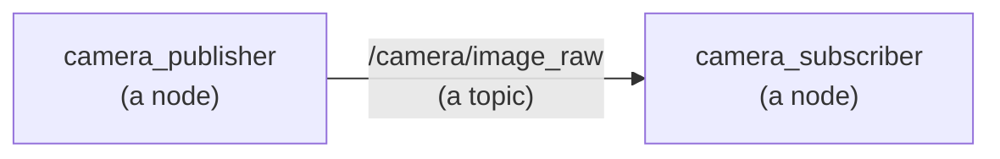

# ROS: the basics

This area explains ROS, the software most robots are built with, using the three
smallest programs that show what it does. The first works with a camera, the
second moves an arm, and the third uses the two together, so that the arm points
at what the camera sees. This doc explains the ideas they share, and each of them
then has a doc of its own:

- [ROS camera](ros-camera.md): one program publishes pictures, and another
  receives them.
- [ROS arm](ros-arm.md): a program moves a two-joint arm by publishing where its
  joints should be.
- [ROS camera and arm](ros-camera-arm.md): a program watches the camera, and
  points the arm at the ball it sees.

No robotics knowledge is needed. It helps to know a little Python.

## Contents

1. [What ROS is](#1-what-ros-is)
2. [Nodes, topics and messages](#2-nodes-topics-and-messages)
3. [Message types and the sensor_msgs package](#3-message-types-and-the-sensor_msgs-package)
4. [Packages and the workspace](#4-packages-and-the-workspace)
5. [Starting nodes: ros2 run and launch files](#5-starting-nodes-ros2-run-and-launch-files)
6. [Looking inside a running robot](#6-looking-inside-a-running-robot)
7. [Frames, TF and URDF](#7-frames-tf-and-urdf)
8. [RViz](#8-rviz)
9. [The programs in this area](#9-the-programs-in-this-area)
10. [Vocabulary](#10-vocabulary)

---

## 1. What ROS is

ROS stands for Robot Operating System, but it is not an operating system like
macOS or Windows. It is a set of libraries and tools for writing robot software,
and it runs on top of an ordinary operating system. This repo uses ROS 2, the
current version, and its Jazzy release.

A robot needs a lot of software. Something has to read the camera, something has
to work out where things are, something has to plan how the arm should move, and
something has to drive the motors. Writing all of that as one big program would
be hard to understand, hard to test, and hard to change. ROS's central idea is to
split it into many small programs instead, each with one job, which run at the
same time and send each other messages. Because each program only sends and
receives messages, one of them can be swapped for another without changing the
rest: a simulated camera can be replaced by a real one, and the program that
reads the pictures never knows the difference.

ROS also comes with a large collection of ready-made parts, written by other
people, that do common jobs, such as working out where every part of an arm is
or showing a robot in 3D. Most of a real robot's software is these parts, joined
together, with a small amount of the robot's own code in between.

## 2. Nodes, topics and messages

Each of those small programs is called a **node**. A node has a name, such as
`camera_publisher`, and it does one job.

Nodes talk to each other by sending **messages** on named channels called
**topics**. A topic's name looks like a file path, such as `/camera/image_raw`.
A node that sends messages on a topic **publishes** to it, and a node that
receives them **subscribes** to it. A topic can have any number of publishers and
subscribers, and they do not need to know about each other: a publisher simply
sends, and every subscriber to that topic receives a copy. In the camera example,
it looks like this:



Every topic carries one **type** of message, and the type says exactly what a
message holds, so that the publisher and the subscriber agree. Message types are
named after the package that defines them, as section 3 explains. A picture is a
`sensor_msgs/Image`, and the `ros2 interface show` command lists what it holds:

```
ros2 interface show sensor_msgs/msg/Image
```

```
std_msgs/Header header
	builtin_interfaces/Time stamp
		int32 sec
		uint32 nanosec
	string frame_id
uint32 height                # image height, that is, number of rows
uint32 width                 # image width, that is, number of columns
string encoding       # Encoding of pixels -- channel meaning, ordering, size
uint8 is_bigendian    # is this data bigendian?
uint32 step           # Full row length in bytes
uint8[] data          # actual matrix data, size is (step * rows)
```

Most messages start with a **header**, like this one. It says when the message
was true, as a timestamp, and which **frame** its numbers are measured in, which
section 7 explains.

In Python, the library for writing nodes is called **rclpy**. A node is a Python
class that extends rclpy's `Node` class, which gives it what it needs to take
part: `create_publisher()` to send messages, `create_subscription()` to receive
them, and `get_logger()` to print lines marked with the node's name. When a node
subscribes, it hands ROS a function to call every time a message arrives, and that
function is called a **callback**. The last thing a node's program does is call
`rclpy.spin()`, which keeps the program running, waiting for messages and calling
the callbacks as they arrive.

The Python code in these examples states the **type** of every value, using
Python's type hints. `self.pictures: int = 0` says that `pictures` is a whole
number, and `def find_ball(picture: NDArray[np.uint8]) -> tuple[float, float] |
None:` says that `find_ball` takes a picture, an array of whole numbers from 0 to
255, and gives back either two decimal numbers, a pixel, or `None`. The ROS
objects have types too: a publisher is a `Publisher`, a timer is a `Timer`, and a
message is an object of its message class, such as `Image`. Python itself does
not check the types when the program runs, so they are there for the reader, to
say what every value is, and for tools such as **mypy**, which read the code and
report any place where a value does not match its type.

## 3. Message types and the sensor_msgs package

Message types are defined in packages, and some packages hold nothing but
message types. The most important of these for a robot is **sensor_msgs**, which
comes with ROS and defines the messages for sensor data: pictures, distances,
joint positions and so on. Because every camera driver, every arm and every
program uses the same definitions, a driver written by one company and a program
written by another can work together without either of them knowing about the
other.

`ros2 interface package sensor_msgs` lists every type in the package. There are
27, and these are the ones you are most likely to meet:

| Type | What one message carries | Where these examples use it |
| --- | --- | --- |
| `Image` | one picture | the camera |
| `CompressedImage` | a picture squeezed into JPEG or PNG, to send it faster | — |
| `CameraInfo` | a camera's lens numbers | the camera, and the camera and arm |
| `PointCloud2` | a cloud of 3D points, usually from a depth camera | the [camera area](../camera/one-box-code.md) |
| `LaserScan` | one sweep of distances from a spinning laser | — |
| `Range` | one distance, from a simple distance sensor | the arm's distance sensor |
| `Imu` | how a sensor is turning and speeding up | — |
| `JointState` | the position of each of a robot's joints | the arm, and the camera and arm |
| `NavSatFix` | a position from satellite navigation, such as GPS | — |
| `BatteryState` | how full a battery is | — |

A few other standard packages of message types come up all the time.
**std_msgs** holds the smallest building blocks, such as the header most messages
start with. **geometry_msgs** holds points, positions, rotations and transforms.
**visualization_msgs** holds markers, the shapes RViz draws.

Each message type is written in a small text file inside its package, which
lists the fields and the type of each one. `Range` is defined in
`sensor_msgs/msg/Range.msg`, and these are its first lines:

```
std_msgs/Header header
uint8 ULTRASOUND=0
uint8 INFRARED=1
uint8 radiation_type
float32 field_of_view
```

When ROS is built, it reads these files and turns each one into a Python class,
and into a C++ class for code written in C++. It puts the Python classes in the
package's `msg` module, which is why a type's full name is `sensor_msgs/msg/Range`
and why Python code gets the class with `from sensor_msgs.msg import Range`.
Making a message is making an object of that class. A new message has every field
empty, meaning zero for numbers, empty text and empty lists, and the code fills in
the fields it needs before publishing it:

```python
from sensor_msgs.msg import Range

reading: Range = Range()                  # a new message: every field starts empty
print(reading.range)                      # 0.0
reading.range = 0.085                     # fill in the fields you need
reading.radiation_type = Range.INFRARED   # a named number from the .msg file: 1
```

A line such as `uint8 INFRARED=1` is not a field but a **constant**, a name for a
number, which the class provides as `Range.INFRARED`. A field can also be a whole
message of its own: `header` is a `std_msgs/Header`, which holds `stamp`, itself a
`builtin_interfaces/Time`, and `frame_id`. That is why `ros2 interface show`
indents some lines, and why Python code reaches the time with
`reading.header.stamp.sec`. The [camera doc](ros-camera.md) explains the `Image`
and `CameraInfo` classes field by field, and the [arm doc](ros-arm.md) does the
same for `JointState` and `Range`.

## 4. Packages and the workspace

ROS code is organised into **packages**. A package is a folder with the code for
one piece of a robot, and a file called `package.xml`, which says what the
package is and which other packages it needs. This area has four packages, in
`src/ros/`, split into the basics and the worked examples:

```
src/ros/
  ros_basics/                    one small program per thing ROS does
    package.xml                  what the package is, and what it needs
    setup.py                     how it is installed, and the names of its programs
    ros_basics/                  its Python code
      nodes.py                   a node
      publisher.py               a topic, from the sending side
      subscriber.py              and from the receiving side
      parameters.py              settings
      service_server.py          a question and an answer
      action_server.py           a long job, watched while it runs
      frames.py                  where the parts are
    launch/basics.launch.py      starting several of them together
    test/test_ros_basics.py      its tests
  ros_applied/                   the three worked examples
    ros_camera/                  the camera example, laid out the same way
    ros_arm/                     the arm example
    ros_camera_arm/              the camera and arm example
```

The folder that holds all the packages is called the **workspace**, and here it is
the whole repo, with the packages under `src/`. **colcon** is ROS's build tool: it
finds every package under `src/`, and installs each one into `install/`, in the
shape ROS expects. `make build` runs it. Before a terminal can use the installed
packages, it has to load `install/setup.bash`, which tells ROS where they are.
The `make` commands do that for you, and so does `make shell`, which opens a
terminal that is ready for `ros2` commands.

Packages can use each other. The camera and arm example has almost no code of its
own: it borrows the camera from `ros_camera` and the arm from `ros_arm`, which is
possible because its `package.xml` says that it needs them.

## 5. Starting nodes: ros2 run and launch files

`ros2 run` starts one node. It takes the package's name and the program's name,
which `setup.py` gives each Python file:

```
ros2 run ros_camera camera_publisher
```

A robot needs several nodes at once, and starting each one by hand, in its own
terminal, would be slow and easy to get wrong. A **launch file** starts them all
together, and stops them all together when you press Ctrl-C:

```
ros2 launch ros_camera camera.launch.py
```

A launch file is a short Python file that lists the nodes to start. This is the
camera example's, with its comments left out:

```python
def generate_launch_description() -> LaunchDescription:
    rviz_layout: str = os.path.join(
        get_package_share_directory('ros_camera'), 'config', 'camera.rviz')
    return LaunchDescription([
        DeclareLaunchArgument('rviz', default_value='true', description='Open RViz.'),
        Node(package='ros_camera', executable='camera_publisher'),
        Node(package='ros_camera', executable='camera_subscriber', output='screen'),
        Node(package='rviz2', executable='rviz2', arguments=['-d', rviz_layout],
             condition=IfCondition(LaunchConfiguration('rviz'))),
    ])
```

Each `Node(...)` starts one program. The first line in the list declares a
**launch argument**, which is a setting you can change on the command line. This
one decides whether RViz opens, so `ros2 launch ros_camera camera.launch.py
rviz:=false` runs the example without the RViz window. `output='screen'` makes a
node's messages appear in the terminal.

When you stop a launch file with Ctrl-C, you may see a line such as `process has
died [pid 64415, exit code -2]`. That is not a crash. Ctrl-C reaches every
program twice, once from the terminal and once from the launch file, and a
Python node that is already stopping when the second one arrives stops at once,
which the launch file reports that way.

## 6. Looking inside a running robot

While nodes are running, the `ros2` command can show what they are doing, from
another terminal. Open one with `make shell`. These are the commands used most,
with what they showed while the camera example was running:

`ros2 node list` lists the running nodes:

```
/camera_publisher
/camera_subscriber
```

`ros2 topic list` lists the topics. `/parameter_events` and `/rosout` are ROS's
own, and are always there:

```
/camera/camera_info
/camera/image_raw
/parameter_events
/rosout
```

`ros2 topic info` shows a topic's type, and how many nodes publish and subscribe
to it:

```
ros2 topic info /camera/image_raw
```

```
Type: sensor_msgs/msg/Image
Publisher count: 1
Subscription count: 1
```

`ros2 topic hz` measures how many messages arrive each second:

```
ros2 topic hz /camera/image_raw
```

```
average rate: 10.025
	min: 0.098s max: 0.101s std dev: 0.00090s window: 10
```

`ros2 topic echo` prints the messages themselves. `--once` stops after one, and
`--no-arr` leaves out long lists of numbers, such as a picture's pixels:

```
ros2 topic echo --once --no-arr /camera/image_raw
```

```
header:
  stamp:
    sec: 1789421464
    nanosec: 122245000
  frame_id: camera
height: 240
width: 320
encoding: rgb8
is_bigendian: 0
step: 960
data: '<sequence type: uint8, length: 230400>'
```

These commands are how you find out what a robot is doing, and they work on any
ROS robot, not only on these examples.

## 7. Frames, TF and URDF

A robot has to know where things are, and "where" only means something when you
say where it is measured from. A **frame** is a set of axes, a starting point and
three directions, that positions are measured in. A robot has a frame for its
base, one for each part of its arm, one for its camera, and so on, and the same
point has different numbers in each of them.

**TF**, short for transform, is the part of ROS that keeps track of how every
frame sits compared with every other one. The frames form a tree, in which each
frame has one parent, and TF can answer the question "where is this frame,
measured in that one?" for any two frames in the tree. Frames and transforms are
explained in detail in the [arm area](../arm/overview.md).

To know where each part of an arm is, ROS needs a description of the arm: its
parts, and how they are joined. **URDF**, the Unified Robot Description Format, is
the file format for that. A URDF file lists the arm's **links**, which are its
rigid parts, and its **joints**, which say how each link is attached to the one
before it and how it can move. A standard node called **robot_state_publisher**
reads the URDF, listens for the angle of every joint on the `/joint_states`
topic, and publishes where every link is on TF. The [arm doc](ros-arm.md) shows
all of this on a two-joint arm.

## 8. RViz

**RViz** is the 3D viewer that comes with ROS. It is itself a node, which
subscribes to topics and draws what arrives: pictures, point clouds, the robot
from its URDF, and the frames from TF. Which things it shows, and where its
windows are, is saved in a layout file ending in `.rviz`, and each example opens
RViz with a layout made for it.

RViz shows only what the nodes publish, so it is the quickest way to check that a
robot's software is doing what you think it is.

## 9. The programs in this area

The area is in two halves. **[ROS basics](ros-basics.md)** is one small program
for each thing ROS is used for, in `src/ros/ros_basics/`: a node, a topic, a
parameter, a service, an action, a frame, and a launch file. Read it beside this
doc, running each program as you reach it.

| Basics | What it shows | Run it with |
| --- | --- | --- |
| [topics](ros-basics.md#3-topics-publishing-and-subscribing), [parameters](ros-basics.md#4-parameters-a-nodes-settings), [launching](ros-basics.md#8-launching-starting-everything-together) | a publisher, a subscriber and a settings node, started together | `make ros.basics` |
| [services](ros-basics.md#5-services-one-question-one-answer) | one node asks another a question and waits for the answer | `make ros.service` |
| [actions](ros-basics.md#6-actions-long-jobs-with-progress) | a long job, reporting progress until it finishes | `make ros.action` |

The three **worked examples**, in `src/ros/ros_applied/`, then put those
together into something a robot actually does:

| Example | What it shows | Run it with | The ROS ideas it uses |
| --- | --- | --- | --- |
| [ROS camera](ros-camera.md) | one node publishes pictures, another receives them and finds a ball | `make ros.camera` | nodes, publishers, subscribers, messages, timers |
| [ROS arm](ros-arm.md) | a node moves a two-joint arm and its gripper by publishing joint positions, and a distance sensor in the gripper measures the table | `make ros.arm` | URDF, joint states, robot_state_publisher, TF, a sensor message |
| [ROS camera and arm](ros-camera-arm.md) | a node watches the camera, and points the arm at the ball | `make ros.camera_arm` | one node that subscribes and publishes, and packages that reuse each other |

Each command builds the workspace, starts the example's launch file, and opens
RViz. Press Ctrl-C to stop it.

---

## 10. Vocabulary

| Term | Full name | Meaning |
| --- | --- | --- |
| ROS | Robot Operating System | the libraries and tools most robot software is built with |
| node | — | one running ROS program, with one job |
| topic | — | a named channel that nodes send messages on, such as `/camera/image_raw` |
| message | — | one piece of data sent on a topic, of a fixed type |
| publish, subscribe | — | send messages on a topic, and receive them |
| message type | — | what a message holds, defined in a `.msg` file, such as `sensor_msgs/msg/Image` |
| sensor_msgs | sensor messages | the standard package of message types for sensor data |
| callback | — | a function a node hands to ROS, which ROS calls when a message arrives |
| parameter | — | a node's setting, which can be read and changed while it runs |
| service | — | one question and one answer between two nodes, with the asker waiting |
| action | — | a long job: a goal, progress while it runs, and a result, and it can be cancelled |
| rclpy | ROS client library for Python | the Python library for writing nodes |
| package | — | a folder with the code for one piece of a robot, and a `package.xml` |
| workspace | — | the folder that holds the packages, under `src/` |
| colcon | collective construction | the tool that builds and installs the packages |
| launch file | — | a Python file that starts several nodes together |
| frame | — | a set of axes that positions are measured in |
| TF | transform | the part of ROS that keeps track of where every frame is |
| URDF | Unified Robot Description Format | the file format that describes a robot's links and joints |
| RViz | ROS visualization | the 3D viewer that comes with ROS |

Next: [ROS basics](ros-basics.md), one small program for each of these ideas.
Then [ROS camera](ros-camera.md), the first worked example.
