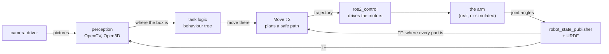
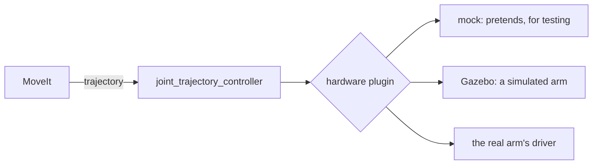

# Tools and libraries for table-mounted arms

A robot arm bolted to a table, or to any platform that does not move, is the
most common kind of arm there is. Factory arms, lab arms and most hobby arms all
work this way.

This doc is a map of the main tools and libraries used to build software for
one. Each tool gets three things: the job it does, in plain terms; the idea, as
pseudo code; and a few lines of real code, so you can see what using it looks
like.

It is a map, not a manual. Every tool here has its own documentation. The aim is
to know what exists, what each tool is for, and how they fit together.

## Why "bolted to a table" matters

A fixed base makes an arm much simpler than a robot that moves around:

- **The base never moves.** Everything the arm does can be measured from one
  frame that stays put.
- **The table is always there, in a known place.** The planner can be told
  about it once and will always avoid it.
- **There is no balancing and no driving.** Only the joints move.

That is why the same small set of tools turns up on almost every such arm.

## How the pieces fit



Read it left to right. The camera sees the table, and perception finds the box.
The task logic decides what to do next. MoveIt plans a path that hits nothing,
and ros2_control drives the motors along it. The joint angles come back, and
robot_state_publisher turns them into the position of every part on TF, which
everything else uses. ROS 2 carries every arrow.

Three tools sit around the edge rather than in the chain. RViz lets you watch
all of it. rosbag2 records it. A simulator can stand in for the real arm and
camera.

| Tool | Its job, in one line |
| --- | --- |
| ROS 2 | carries messages between all the other programs |
| URDF, xacro | describe the arm: its links, joints and sizes |
| robot_state_publisher, TF2 | turn joint angles into the position of every part |
| RViz | show all of it in 3D |
| MoveIt 2 | plan a path to a goal without hitting anything |
| ros2_control | drive the motors to follow that path |
| Gazebo, MuJoCo | simulate the arm, so you can try things safely |
| KDL, Pinocchio, SciPy | the kinematics and rotation maths |
| camera drivers, OpenCV, Open3D | turn camera pictures into objects |
| hand-eye calibration | find where the camera is, relative to the arm |
| behaviour trees | put the steps of a task in order |
| rosbag2 | record everything, and play it back |
| colcon, rosdep, pixi | build the code, and install what it needs |

## Contents

1. [ROS 2: the plumbing](#1-ros-2-the-plumbing)
2. [URDF and xacro: describing the arm](#2-urdf-and-xacro-describing-the-arm)
3. [robot_state_publisher and TF2: where every part is](#3-robot_state_publisher-and-tf2-where-every-part-is)
4. [RViz: seeing it](#4-rviz-seeing-it)
5. [MoveIt 2: planning a safe path](#5-moveit-2-planning-a-safe-path)
6. [ros2_control: driving the motors](#6-ros2_control-driving-the-motors)
7. [Simulators: Gazebo and MuJoCo](#7-simulators-gazebo-and-mujoco)
8. [Kinematics and maths: KDL, Pinocchio and SciPy](#8-kinematics-and-maths-kdl-pinocchio-and-scipy)
9. [Perception: camera drivers, OpenCV and Open3D](#9-perception-camera-drivers-opencv-and-open3d)
10. [Hand-eye calibration: tying the camera to the arm](#10-hand-eye-calibration-tying-the-camera-to-the-arm)
11. [Behaviour trees: putting a task in order](#11-behaviour-trees-putting-a-task-in-order)
12. [rosbag2: recording and replaying](#12-rosbag2-recording-and-replaying)
13. [Building it: colcon, rosdep and pixi](#13-building-it-colcon-rosdep-and-pixi)
14. [Putting it together: one pick and place](#14-putting-it-together-one-pick-and-place)
15. [What is installed here, and what was checked](#15-what-is-installed-here-and-what-was-checked)
16. [Vocabulary](#16-vocabulary)

### About the code in this doc

The snippets are short on purpose. Some run in this repo as it is. Others need a
tool that is not installed here, and each section says which.

Every snippet that could be run was run before it went in, and section 15 lists
which. Where it helps, they use the two-joint arm from the
[arm area](arm/overview.md). Link 1 is 3 m and link 2 is 2 m. At 30° and 60°, its
gripper is at `(2.598, 3.5)`. Four different routes below were checked against
that number, and all four agree.

---

## 1. ROS 2: the plumbing

**What it is.** ROS 2 — the Robot Operating System — is not really an operating
system. It is a way for many small programs, called **nodes**, to talk to each
other. Each node does one job: one talks to the camera, one plans motion, one
drives the motors.

Nodes talk in three ways:

| Way | It is like | Used for |
| --- | --- | --- |
| **topic** | a radio station: anyone can listen | streams, such as joint angles 100 times a second |
| **service** | a question with one answer | quick requests, such as "is the gripper closed?" |
| **action** | a job that reports progress, and can be cancelled | slow jobs, such as "move to this pose" |

Actions matter most for arms. A move takes seconds, you want to know how it is
going, and you must be able to stop it.

**Pseudo code**

```
the arm driver:  every 10 ms, publish the joint angles on the topic "joint_states"
any other node:  listen to "joint_states", and use each message as it arrives
the planner:     send an action goal "move there", watch the progress, get a result
```

**Real code.** Publishing joint angles ten times a second, the way an arm driver
does:

```python
import math

import rclpy
from rclpy.node import Node
from sensor_msgs.msg import JointState

rclpy.init()
node = Node('joint_publisher')
pub = node.create_publisher(JointState, 'joint_states', 10)


def tick():
    msg = JointState()
    msg.header.stamp = node.get_clock().now().to_msg()
    msg.name = ['joint1', 'joint2']
    msg.position = [math.radians(30), math.radians(60)]
    pub.publish(msg)


node.create_timer(0.1, tick)
rclpy.spin(node)
```

Installed here, and every area in this repo is built on it.

---

## 2. URDF and xacro: describing the arm

**What it is.** URDF — the Unified Robot Description Format — is an XML file
that describes an arm. It lists the **links**, which are the rigid parts, and the
**joints**, which connect them and say how they move. It also gives their sizes,
their limits, and what they look like. Almost every other tool reads it: RViz to draw the arm, MoveIt to plan for
it, and the simulator to simulate it.

A table-mounted arm starts with one special joint: a **fixed** joint from the
world to the arm's base. That one line is what "bolted to the table" means to
the software.

**xacro** — XML macros — is URDF with variables and repeats. Real arms have six
or seven joints that look much alike, and xacro lets you write one and reuse it.
It turns into a plain URDF before anything reads it.

**Pseudo code**

```
world
 └─ fixed:  base_link              the arm is bolted to the table
     └─ turns:  link1              joint 1, about the up axis
         └─ turns:  link2          joint 2, 3 m along link 1
             └─ fixed:  gripper    2 m along link 2
```

**Real code.** The arm from the arm area, as URDF:

```xml
<robot name="table_arm">
  <link name="world"/>
  <link name="base_link"/>
  <link name="link1"/>
  <link name="link2"/>
  <link name="gripper"/>

  <!-- The arm is bolted to the table: a fixed joint, so it never moves. -->
  <joint name="bolted_to_table" type="fixed">
    <parent link="world"/>
    <child link="base_link"/>
  </joint>

  <joint name="joint1" type="revolute">
    <parent link="base_link"/>
    <child link="link1"/>
    <axis xyz="0 0 1"/>
    <limit lower="-3.14" upper="3.14" effort="10" velocity="1.0"/>
  </joint>

  <joint name="joint2" type="revolute">
    <parent link="link1"/>
    <child link="link2"/>
    <origin xyz="3 0 0"/>
    <axis xyz="0 0 1"/>
    <limit lower="-3.14" upper="3.14" effort="10" velocity="1.0"/>
  </joint>

  <joint name="gripper_mount" type="fixed">
    <parent link="link2"/>
    <child link="gripper"/>
    <origin xyz="2 0 0"/>
  </joint>
</robot>
```

And a xacro macro, writing a link once and using it twice:

```xml
<robot name="table_arm" xmlns:xacro="http://www.ros.org/wiki/xacro">
  <xacro:macro name="arm_link" params="name length">
    <link name="${name}">
      <visual><geometry><box size="${length} 0.1 0.1"/></geometry></visual>
    </link>
  </xacro:macro>

  <xacro:arm_link name="link1" length="3"/>
  <xacro:arm_link name="link2" length="2"/>
</robot>
```

```
xacro table_arm.urdf.xacro > table_arm.urdf
```

URDF is installed here. xacro is not; add it with `pixi add ros-jazzy-xacro`.

---

## 3. robot_state_publisher and TF2: where every part is

**What it is.** TF2 keeps track of frames, and the [rviz](rviz/overview.md) and
[arm](arm/overview.md) areas cover it in detail. **robot_state_publisher** is
the node that fills TF for an arm. It reads the URDF once, listens for joint
angles, and publishes where every link is.

It does exactly what step 4 of the arm area does by hand, except that it works
for any arm, straight from its URDF. It also publishes the URDF itself, on
`/robot_description`, which is where RViz and MoveIt read it from.

**Pseudo code**

```
read the URDF once
publish every fixed joint once, on /tf_static        (they never change)
whenever joint angles arrive on /joint_states:
    for each moving joint: turn its angle into a transform     (arm area, step 2)
    publish them all on /tf
```

**Real code.** Start it from a launch file:

```python
from pathlib import Path

from launch import LaunchDescription
from launch_ros.actions import Node


def generate_launch_description():
    urdf_text = Path('table_arm.urdf').read_text()
    return LaunchDescription([
        Node(package='robot_state_publisher', executable='robot_state_publisher',
             parameters=[{'robot_description': urdf_text}]),
    ])
```

Then ask TF where the gripper is, from any node:

```python
buffer = Buffer()
listener = TransformListener(buffer, node)

where = buffer.lookup_transform('world', 'gripper', Time()).transform.translation
```

Run it with the joint publisher from section 1, holding the arm at 30° and 60°.
It reports `(2.598, 3.500, 0.000)`: the arm area's answer, reached a completely
different way.

One gotcha found while checking this: passing the URDF on the command line, with
`-p robot_description:=...`, fails. The line breaks in the XML break the
parser. Use a launch file, as above.

Installed here.

---

## 4. RViz: seeing it

**What it is.** RViz — ROS Visualization — draws what is on the topics, in 3D.
For an arm, its **RobotModel** display draws the arm itself: it reads the URDF
from `/robot_description` and places each link where TF says it is. The
[rviz area](rviz/overview.md) of this repo is all about it.

**Pseudo code**

```
read the URDF from /robot_description
every frame on screen:
    for each link: look up where TF says it is, and draw its shape there
```

**Real code.**

```
ros2 run rviz2 rviz2
```

Then choose *Add → RobotModel*, set *Description Topic* to `/robot_description`,
and set the Fixed Frame to `world`. To move the joints by hand with sliders, run
`ros2 run joint_state_publisher_gui joint_state_publisher_gui` alongside it.

RViz is installed here. The slider tool is not; add it with
`pixi add ros-jazzy-joint-state-publisher-gui`.

---

## 5. MoveIt 2: planning a safe path

**What it is.** MoveIt is the main motion-planning framework for arms in ROS 2.
You give it a goal, usually "put the gripper here, pointing this way". It works
out how every joint should move to get there. The path must not hit the table,
anything on it, or the arm itself, or push any joint past its limits.

Inside, it does four jobs:

- **inverse kinematics**: which joint angles put the gripper at a given pose
  (section 8)
- **collision checking**, against a **planning scene** holding the arm, the
  table and any known objects
- **planning**: searching for a path between the two, by default with OMPL, the
  Open Motion Planning Library
- **timing**: turning the path into a trajectory with speeds, which it hands to
  ros2_control (section 6)

The **MoveIt Setup Assistant** reads your URDF and writes a configuration
package. It records which joints make up the arm, and which solver to use. It
also lists the link pairs that can never touch, so that time is not wasted
checking them.

For a table-mounted arm, the first thing to put in the planning scene is the
table.

**Pseudo code**

```
tell MoveIt about the table, once
goal = the gripper at (0.4, 0.1, 0.3), measured from base_link
path = plan from the current joint angles to the goal,
       avoiding the table, the arm itself, and anything else in the scene
if a path was found:
    send it to the controllers, and wait until the arm gets there
```

**Real code.** MoveItPy is MoveIt's Python interface. This is for a typical
six-joint arm, started from a launch file that loads its MoveIt configuration:

```python
from geometry_msgs.msg import PoseStamped
from moveit.planning import MoveItPy

robot = MoveItPy(node_name='moveit_py')
arm = robot.get_planning_component('arm')

goal = PoseStamped()
goal.header.frame_id = 'base_link'
goal.pose.position.x, goal.pose.position.y, goal.pose.position.z = 0.4, 0.1, 0.3
goal.pose.orientation.w = 1.0

arm.set_start_state_to_current_state()
arm.set_goal_state(pose_stamped_msg=goal, pose_link='gripper')
plan = arm.plan()
if plan:
    robot.execute(plan.trajectory, controllers=[])
```

And telling it about the table, as a flat box just under the arm's base:

```python
from geometry_msgs.msg import Pose
from moveit_msgs.msg import CollisionObject
from shape_msgs.msg import SolidPrimitive

table = CollisionObject(id='table', operation=CollisionObject.ADD)
table.header.frame_id = 'base_link'
table.primitives.append(SolidPrimitive(type=SolidPrimitive.BOX, dimensions=[1.2, 0.8, 0.05]))
top = Pose()
top.position.z = -0.025
top.orientation.w = 1.0
table.primitive_poses.append(top)

with robot.get_planning_scene_monitor().read_write() as scene:
    scene.apply_collision_object(table)
    scene.current_state.update()
```

In C++ the same thing is done with `MoveGroupInterface`, which most MoveIt
tutorials use.

Not installed here. Add it with `pixi add ros-jazzy-moveit ros-jazzy-moveit-py`.
These snippets were syntax-checked but not run.

---

## 6. ros2_control: driving the motors

**What it is.** ros2_control is the layer between "a trajectory" and "the
motors". It runs one loop at a fixed rate, often 100 to 1,000 times a second.
Each time round, it reads where every joint is, lets the controllers decide what
to do, and sends commands to the hardware.

It uses two kinds of plugin:

- **controllers** decide what to do. `joint_trajectory_controller` follows a
  trajectory from MoveIt. `joint_state_broadcaster` publishes `/joint_states`,
  which feeds robot_state_publisher from section 3.
- **hardware interfaces** talk to one particular arm. Arm makers ship their own:
  Universal Robots, Franka and Kinova all do. There is also a mock one that
  just pretends, for testing, and one for the Gazebo simulator.

That split is the point. Swap the hardware plugin and nothing above it changes:



MoveIt cannot tell the difference, which is why code tried in simulation runs
unchanged on the real arm.

**Pseudo code**

```
every 10 ms:
    read:    ask the hardware where each joint is
    update:  each controller works out what it wants
             (following a trajectory: where should each joint be right now?)
    write:   send those commands to the hardware
```

**Real code.** In the URDF, say which hardware drives which joints. Here it is
the mock:

```xml
<ros2_control name="table_arm" type="system">
  <hardware>
    <plugin>mock_components/GenericSystem</plugin>
  </hardware>
  <joint name="joint1">
    <command_interface name="position"/>
    <state_interface name="position"/>
  </joint>
  <joint name="joint2">
    <command_interface name="position"/>
    <state_interface name="position"/>
  </joint>
</ros2_control>
```

Then choose the controllers, in a YAML file:

```yaml
controller_manager:
  ros__parameters:
    update_rate: 100
    joint_state_broadcaster:
      type: joint_state_broadcaster/JointStateBroadcaster
    arm_controller:
      type: joint_trajectory_controller/JointTrajectoryController

arm_controller:
  ros__parameters:
    joints: [joint1, joint2]
    command_interfaces: [position]
    state_interfaces: [position]
```

And send the arm a trajectory directly, without MoveIt:

```python
from builtin_interfaces.msg import Duration
from trajectory_msgs.msg import JointTrajectory, JointTrajectoryPoint

trajectory = JointTrajectory(joint_names=['joint1', 'joint2'])
trajectory.points.append(JointTrajectoryPoint(positions=[0.5236, 1.0472],
                                              time_from_start=Duration(sec=2)))
pub = node.create_publisher(JointTrajectory, '/arm_controller/joint_trajectory', 10)
pub.publish(trajectory)
```

`ros2 control list_controllers` shows what is loaded and running.

Not installed here. Add it with
`pixi add ros-jazzy-ros2-control ros-jazzy-ros2-controllers`. These snippets were
syntax-checked but not run.

---

## 7. Simulators: Gazebo and MuJoCo

**What it is.** A simulator pretends to be the arm and its world. It works out
the physics — motors, weight, contact — and can fake cameras too. You try your
code there first, where a mistake costs nothing.

- **Gazebo** fits most closely with ROS 2. Through `ros_gz` and
  `gz_ros2_control`, the simulated arm is driven by the same ros2_control
  controllers as the real one, and publishes the same topics. The same MoveIt
  setup works unchanged.
- **MuJoCo** is a fast physics engine, very popular in research and for training
  learned controllers. It has a simple Python interface, and is not tied to ROS.

PyBullet and NVIDIA Isaac Sim are also common.

Each one needs to know the base is bolted down. In Gazebo, that is the fixed
world-to-base joint already in the URDF. In MuJoCo, a body with no joint is
welded to the world automatically.

**Pseudo code**

```
load the arm and the table
every step, about a millisecond:
    apply the motor commands
    let physics move everything forward a little
    report the new joint angles, and camera pictures if there is a camera
```

**Real code.** Gazebo: start it, and add the arm from `/robot_description`:

```
ros2 launch ros_gz_sim gz_sim.launch.py gz_args:=empty.sdf
ros2 run ros_gz_sim create -topic robot_description -name table_arm
```

To drive it with ros2_control, the mock hardware from section 6 is replaced by
Gazebo's, and a Gazebo plugin is added. In a xacro file:

```xml
<ros2_control name="table_arm" type="system">
  <hardware>
    <plugin>gz_ros2_control/GazeboSimSystem</plugin>
  </hardware>
  <!-- the same joints as section 6 -->
</ros2_control>

<gazebo>
  <plugin filename="gz_ros2_control-system" name="gz_ros2_control::GazeboSimROS2ControlPlugin">
    <parameters>$(find table_arm)/config/controllers.yaml</parameters>
  </plugin>
</gazebo>
```

MuJoCo: the same arm, described in MuJoCo's own format, MJCF. The base has no
joint, so it is bolted down:

```xml
<mujoco model="table_arm">
  <default>
    <joint damping="150"/>
    <geom type="capsule" size="0.05" density="100"/>
  </default>
  <worldbody>
    <body name="base_link">
      <body name="link1">
        <joint name="joint1" type="hinge" axis="0 0 1"/>
        <geom fromto="0 0 0 3 0 0"/>
        <body name="link2" pos="3 0 0">
          <joint name="joint2" type="hinge" axis="0 0 1"/>
          <geom fromto="0 0 0 2 0 0"/>
          <site name="gripper" pos="2 0 0"/>
        </body>
      </body>
    </body>
  </worldbody>
  <actuator>
    <position joint="joint1" kp="200"/>
    <position joint="joint2" kp="200"/>
  </actuator>
</mujoco>
```

Then ask the motors for 30° and 60°, and let physics run:

```python
import math

import mujoco

model = mujoco.MjModel.from_xml_path('table_arm.xml')
data = mujoco.MjData(model)
data.ctrl[:] = [math.radians(30), math.radians(60)]
for _ in range(5000):                      # 10 simulated seconds
    mujoco.mj_step(model, data)
print(data.site('gripper').xpos)           # [2.598 3.5   0.   ]
```

The simulated arm swings to 30° and 60°, and the gripper stops at
`(2.598, 3.5)` — the same answer again, this time from physics.

One lesson from checking it: the first version used `damping="5"`, and after 10
simulated seconds the arm was still swinging, at 17° and 57°. For a 5 m arm that
is far too little damping. A simulator does exactly what you tell it, including
when what you told it is unrealistic.

Neither is installed here. Add MuJoCo with `pixi add mujoco`, or Gazebo with
`pixi add ros-jazzy-ros-gz ros-jazzy-gz-ros2-control`. The MuJoCo snippet was run
in a separate environment. The Gazebo ones were syntax-checked but not run.

---

## 8. Kinematics and maths: KDL, Pinocchio and SciPy

**What it is.** The maths from the [arm area](arm/overview.md), done by
libraries. There are three questions:

- **forward kinematics**: given the joint angles, where is the gripper?
  This is joining transforms, exactly as in the arm area.
- **inverse kinematics**, or **IK**: given where the gripper should be, what
  should the joint angles be? This is the hard direction. There may be several
  answers, or none, so it is solved by searching.
- **the Jacobian**: how far the gripper moves when each joint turns a little.
  It is used for smooth, direct moves like "slide the gripper 1 cm left".

The usual libraries:

- **KDL**, the Kinematics and Dynamics Library, is MoveIt's default IK solver.
  **TRAC-IK** is a popular replacement that succeeds more often.
- **Pinocchio** is a fast kinematics and dynamics library that reads a URDF.
  It is common in research and in control that optimises a motion.
- **SciPy** and **NumPy** handle the everyday rotation maths: quaternions,
  angles and rotation matrices.

**Pseudo code**

```
forward:   angles -> pose     join each link's transform, from base to gripper
inverse:   pose -> angles     guess some angles, see how far off the gripper is,
                              nudge the angles to close the gap, and repeat
jacobian:  a table: for a small turn of each joint, how far the gripper moves
```

**Real code.** Pinocchio, forward kinematics straight from the URDF in
section 2:

```python
import math

import numpy as np
import pinocchio as pin

model = pin.buildModelFromUrdf('table_arm.urdf')
data = model.createData()
q = np.array([math.radians(30), math.radians(60)])
pin.forwardKinematics(model, data, q)
pin.updateFramePlacements(model, data)
print(data.oMf[model.getFrameId('gripper')].translation)   # [2.598 3.5   0.   ]
```

`(2.598, 3.5)` once more. The same library gives the Jacobian, with
`pin.computeFrameJacobian`. For this arm it is a table of 6 rows and 2 columns:
six ways the gripper can move, and two joints to move it with.

Choosing MoveIt's IK solver, in its `kinematics.yaml`:

```yaml
arm:
  kinematics_solver: kdl_kinematics_plugin/KDLKinematicsPlugin
  kinematics_solver_timeout: 0.05
```

SciPy, turning an angle into the quaternion ROS stores:

```python
from scipy.spatial.transform import Rotation

Rotation.from_euler('z', 90, degrees=True).as_quat()   # [0, 0, 0.7071, 0.7071]
```

The order is `x, y, z, w`, the same order ROS uses, and the same answer as
`yaw_to_quaternion` in the arm area.

NumPy is installed here. Pinocchio and SciPy are not; add them with
`pixi add pinocchio scipy`. Both snippets were run in a separate environment.

---

## 9. Perception: camera drivers, OpenCV and Open3D

**What it is.** Turning pictures into objects. Three kinds of tool do it:

- **Camera drivers** publish what the camera sees, as the same topics the
  [camera area](camera/overview.md) publishes: colour, depth, the four lens
  numbers, and a point cloud. `realsense2_camera` is the driver for Intel
  RealSense cameras, and Orbbec and Stereolabs make similar ones.
- **OpenCV** is the standard library for 2D pictures: colours, edges, shapes and
  printed markers. `cv_bridge` converts between ROS images and OpenCV.
- **Open3D**, or **PCL** (the Point Cloud Library), works on 3D point clouds.

For a table-top arm there is one classic recipe: remove the table, then group
what is left into objects. It is exactly the job Part 2 of the camera area calls
telling the boxes apart.

**Pseudo code**

```
points = the depth picture, as a point cloud          (camera area, section 10)
table  = the biggest flat surface among the points     (RANSAC: pick 3 points,
                                                        make a plane, count how
                                                        many agree, keep the best)
rest   = every point not on the table
clumps = the rest, split into groups of nearby points  (clustering)
drop clumps too small to be an object
for each clump: its middle and its height
```

**Real code.** OpenCV, finding the red box by its colour:

```python
image = bridge.imgmsg_to_cv2(msg, desired_encoding='bgr8')
hsv = cv2.cvtColor(image, cv2.COLOR_BGR2HSV)
mask = cv2.inRange(hsv, (0, 120, 70), (10, 255, 255))      # red-ish pixels
contours, _ = cv2.findContours(mask, cv2.RETR_EXTERNAL, cv2.CHAIN_APPROX_SIMPLE)
box = max(contours, key=cv2.contourArea)
x, y, w, h = cv2.boundingRect(box)
```

Run on the camera area's three-box picture, this finds one red region of 2,624
pixels. That is exactly the red box: the camera area's mask counts the same
2,624.

Open3D, the table-top recipe, on the camera area's point cloud:

```python
pcd = o3d.geometry.PointCloud(o3d.utility.Vector3dVector(xyz))
plane, on_table = pcd.segment_plane(distance_threshold=0.005, ransac_n=3,
                                    num_iterations=1000)
objects = pcd.select_by_index(on_table, invert=True)
labels = np.array(objects.cluster_dbscan(eps=0.02, min_points=20))
boxes = [k for k in range(labels.max() + 1) if (labels == k).sum() >= 100]
```

Of 19,200 points, it put 17,238 on the table, and found the table perfectly
flat at height 0. The rest split into three large clumps, one per box, each with
the right middle and height — without using the simulator's mask at all.

It also found a fourth clump of just 20 points: a strip of the green box's side,
which came apart from its top. That is normal. It is why the last line drops any
clump smaller than 100 points, and real pipelines do the same.

Starting a RealSense camera looks like this. `align_depth` lines the depth
picture's pixels up with the colour picture's:

```
ros2 launch realsense2_camera rs_launch.py align_depth.enable:=true pointcloud.enable:=true
```

OpenCV and cv_bridge are installed here, and the OpenCV snippet was run here.
Open3D is not installed; add it with `pixi add open3d`, and its snippet was run
in a separate environment. The RealSense driver is not available for Apple
Silicon through RoboStack.

---

## 10. Hand-eye calibration: tying the camera to the arm

**What it is.** The camera finds the box at a point measured from the camera.
The arm needs it measured from its own base. Converting between them needs the
transform from the camera to the arm. That has to be measured, because nobody
mounts a camera to the millimetre. Measuring it is **hand-eye
calibration**.

There are two setups:

- **eye-in-hand**: the camera is on the gripper, and moves with it.
  Calibration finds the camera relative to the gripper.
- **eye-to-hand**: the camera is fixed on a stand beside the table.
  Calibration finds the camera relative to the arm's base.

`easy_handeye2` and MoveIt Calibration wrap the whole process: moving the arm,
taking pictures, and solving. Underneath, OpenCV's `calibrateHandEye` does the
solving.

**Pseudo code**

```
fix a calibration board, a printed pattern, where the camera can see it
repeat about 15 times:
    move the arm to a new pose
    record where the gripper is, from TF
    record where the board is, from the camera, by spotting the pattern
solve for the one camera mount that explains every pair
publish it once, as a fixed transform
```

**Real code.** The solving step, for a camera on the gripper:

```python
R_cam2gripper, t_cam2gripper = cv2.calibrateHandEye(
    R_gripper2base, t_gripper2base,       # 15 arm poses, from TF
    R_target2cam, t_target2cam)           # 15 board poses, seen by the camera
```

Checked with 15 made-up arm poses built around a hidden camera mount, it gave
that mount back exactly. For a camera on a stand, pass each arm pose the other
way round: the base relative to the gripper. What comes back is then the camera
relative to the base.

Then publish the answer, once, as a fixed transform:

```
ros2 run tf2_ros static_transform_publisher --x 0.5 --y 0 --z 0.6 \
  --roll 0 --pitch 1.57 --yaw 0 --frame-id base_link --child-frame-id camera_link
```

OpenCV and tf2 are installed here, and both snippets were run here.

---

## 11. Behaviour trees: putting a task in order

**What it is.** A pick and place is many steps, and any of them can fail. A
**behaviour tree** lays the steps out as a tree:

- a **Sequence** runs its children in order, and stops at the first failure
- a **Fallback** tries its children in order, until one works

That is easier to read and change than a long chain of `if` statements, and
retries and alternatives are part of its shape.

- **BehaviorTree.CPP** is the most widely used in ROS 2. Trees are written in
  XML, and the steps in C++.
- **py_trees** is the same idea in Python, where a Fallback is called a
  Selector.
- **MoveIt Task Constructor** is built for arms. It breaks a pick into stages
  such as approach, grasp and lift, and plans them together.

**Pseudo code**

```
pick and place: in order, stopping at the first failure
    find the box
    grasp: try in order, until one works
        grasp from above
        grasp from the side
    move to the bin
    let go
```

**Real code.** In BehaviorTree.CPP:

```xml
<root BTCPP_format="4">
  <BehaviorTree ID="PickAndPlace">
    <Sequence>
      <FindBox/>
      <Fallback>
        <GraspFromAbove/>
        <GraspFromSide/>
      </Fallback>
      <MoveToBin/>
      <LetGo/>
    </Sequence>
  </BehaviorTree>
</root>
```

In py_trees, where `FindBox` and the rest are your own steps:

```python
grasp = py_trees.composites.Selector('grasp', memory=False)
grasp.add_children([GraspFromAbove(), GraspFromSide()])

pick_and_place = py_trees.composites.Sequence('pick and place', memory=True)
pick_and_place.add_children([FindBox(), grasp, MoveToBin(), LetGo()])

py_trees.trees.BehaviourTree(pick_and_place).tick()
```

With stand-in steps, and grasping from above set to fail, it prints:

```
{-} pick and place [✓]
    --> find the box [✓] -- success
    [o] grasp [✓]
        --> grasp from above [✕] -- failure
        --> grasp from the side [✓] -- success
    --> move to the bin [✓] -- success
    --> let go [✓] -- success
```

Grasping from above failed, the Fallback tried the side instead, and the whole
task still succeeded.

Neither is installed here. Add them with `pixi add ros-jazzy-behaviortree-cpp`
or `pixi add ros-jazzy-py-trees`. The py_trees snippet was run in a separate
environment, and the XML was checked for well-formedness but not run.

---

## 12. rosbag2: recording and replaying

**What it is.** rosbag2 records the messages on chosen topics into a file,
called a **bag**, and plays them back later exactly as they happened. For an
arm, that means recording one failed grasp once. You can then replay it as often
as you like while you fix the perception code, without touching the robot.

**Pseudo code**

```
record:  listen to the chosen topics, and write every message and its time to a file
play:    read the file, and publish each message again, at the same pace
```

**Real code.**

```
ros2 bag record /joint_states /tf /camera/depth/image_raw -o pick_attempt
ros2 bag info pick_attempt
ros2 bag play pick_attempt
```

In this repo, recording `/joint_states` from section 1 for four seconds gave 44
messages: ten a second, as published.

One gotcha, found while checking this: **stop recording with Ctrl-C.** Stopped
any other way, the bag is left without its metadata file, and `ros2 bag` cannot
open it.

Installed here, and run here.

---

## 13. Building it: colcon, rosdep and pixi

**What it is.** Three tools get the code built and its needs installed:

- **colcon** builds every ROS package in a workspace, in the right order.
  `make build` in this repo runs it.
- **rosdep** installs the system packages that each ROS package lists as
  needing. It is the standard way on Ubuntu.
- **pixi** is how this repo installs ROS 2 and everything else, into one folder,
  with exact versions pinned. It is also how to add any tool in this doc.

**Pseudo code**

```
pixi:    read pixi.toml, and install exactly those versions into .pixi/
colcon:  find every package under src/, work out which needs which,
         and build them in that order
```

**Real code.**

```
pixi add ros-jazzy-moveit                            # add a tool to this repo
colcon build --symlink-install                       # what make build runs
rosdep install --from-paths src --ignore-src -y      # on Ubuntu, instead of pixi
```

Installed here.

---

## 14. Putting it together: one pick and place

One pick, from start-up to letting go, naming the tool at each step:

```
at start-up:
    robot_state_publisher reads the URDF                       (sections 2, 3)
    ros2_control starts the controllers, and connects the arm  (section 6)
    MoveIt loads its setup, and adds the table to its scene    (section 5)
    the camera-to-base transform is published                  (section 10)

the task, as a behaviour tree                                  (section 11)
    find the box:
        the camera driver publishes a point cloud              (section 9)
        Open3D removes the table, and finds the box's clump    (section 9)
        TF moves the box's middle into base_link               (section 3)
    grasp:
        MoveIt plans to just above the box, then down to it    (section 5)
        ros2_control drives the arm along the plan             (section 6)
        the gripper closes, through a service or action        (section 1)
    move to the bin, and let go:
        the same again

all the while:
    RViz shows it, and rosbag2 records it                      (sections 4, 12)

and before any of it touches a real arm:
    the same launch files run against Gazebo                   (section 7)
```

Every arrow in that is a ROS 2 topic, service or action.

---

## 15. What is installed here, and what was checked

"Run here" means the snippet was run in this repo. "Run separately" means it was
run in a throwaway environment, so this repo was not changed. "Not run" means it
was only checked for syntax, because the tool was too large to install just for
this.

| Tool | Installed here | To add it | Snippet |
| --- | --- | --- | --- |
| ROS 2 (rclpy) | yes | — | run here |
| URDF, robot_state_publisher, TF2 | yes | — | run here |
| xacro | no | `pixi add ros-jazzy-xacro` | not run |
| RViz | yes | — | used in the rviz area |
| joint_state_publisher_gui | no | `pixi add ros-jazzy-joint-state-publisher-gui` | not run |
| MoveIt 2 | no | `pixi add ros-jazzy-moveit ros-jazzy-moveit-py` | not run |
| ros2_control | no | `pixi add ros-jazzy-ros2-control ros-jazzy-ros2-controllers` | not run |
| Gazebo | no | `pixi add ros-jazzy-ros-gz ros-jazzy-gz-ros2-control` | not run |
| MuJoCo | no | `pixi add mujoco` | run separately |
| Pinocchio | no | `pixi add pinocchio` | run separately |
| SciPy | no | `pixi add scipy` | run separately |
| OpenCV, cv_bridge | yes | — | run here |
| Open3D | no | `pixi add open3d` | run separately |
| RealSense driver | no | not available for Apple Silicon | not run |
| hand-eye calibration (OpenCV) | yes | — | run here |
| BehaviorTree.CPP | no | `pixi add ros-jazzy-behaviortree-cpp` | not run |
| py_trees | no | `pixi add ros-jazzy-py-trees` | run separately |
| rosbag2 | yes | — | run here |

The two-joint arm at 30° and 60° was worked out four ways, and every one gave the
gripper at `(2.598, 3.5)`:

| Route | Section |
| --- | --- |
| by hand, joining transforms | [arm area](arm/overview.md) |
| URDF, robot_state_publisher and TF | 3 |
| Pinocchio | 8 |
| MuJoCo, simulating the physics | 7 |

---

## 16. Vocabulary

| Term | Full name | Meaning |
| --- | --- | --- |
| node | — | one running program in a ROS system |
| topic | — | a named stream of messages, which anyone can listen to |
| service | — | a question with one answer |
| action | — | a long job that reports progress, and can be cancelled |
| URDF | Unified Robot Description Format | the XML file describing an arm's links and joints |
| xacro | XML macros | URDF with variables and repeats |
| link | — | one rigid part of an arm |
| joint | — | what connects two links, and how they move |
| fixed joint | — | a joint that never moves, such as base to table |
| planning scene | — | everything MoveIt must avoid: the arm, the table, known objects |
| OMPL | Open Motion Planning Library | the path planners MoveIt uses by default |
| IK | inverse kinematics | from where the gripper should be, to the joint angles |
| Jacobian | — | how far the gripper moves for a small turn of each joint |
| trajectory | — | a path, plus when to be at each point along it |
| controller | — | code that turns a goal into motor commands, many times a second |
| hardware interface | — | the plugin that talks to one particular arm |
| KDL | Kinematics and Dynamics Library | MoveIt's default IK solver |
| MJCF | MuJoCo XML format | how MuJoCo describes a robot |
| PCL | Point Cloud Library | a library for 3D point clouds, like Open3D |
| RANSAC | random sample consensus | finding a shape by guessing from a few points, and keeping the guess most points agree with |
| clustering | — | splitting points into groups that sit close together |
| eye-in-hand | — | a camera mounted on the gripper |
| eye-to-hand | — | a camera fixed beside the arm |
| behaviour tree | — | a task laid out as a tree of steps, with fallbacks |
| bag | — | a file of recorded messages, from rosbag2 |
